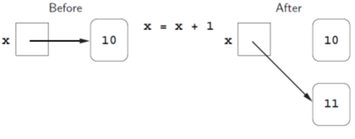

---
jupytext:
  formats: md:myst
  text_representation:
    extension: .md
    format_name: myst
kernelspec:
  display_name: Python 3
  language: python
  name: python3
---

# Memory management in Python
The memory model for understanding how variables are stored in Python is different from other programming languages. In most programming languages, variables can be thought of as a named storage location in computer memory, a box that we can put a value in. When the variable change,s the old value is erased and a new one written in. 


In Python, values may end up anywhere in memory, and variables are used to refer to them. Assigning a variable is like putting one of those little yellow sticky notes on teh value and saying, "this is x." This is memory model is called the sticky-note model. 



What happens when execute the following statement?

```
<<variable>> = <<expression>>
```

This is executed as follows:
1. Evaluate the expression on the right of the `=` sign to produce a value. This value has a memory address. We can call this an object: a value at a memory address with a type. 
2. Store the memory address of the value in the variable on the left of the `=`. Create a new variable if that name does not already exist; otherwise, just reuse the existing variable, replacing the memory address that it contains.

```{code-cell} ipython3
difference = 20
double = 2 * difference
print(double)
difference = 5
print(double)
```

```{code-cell} ipython3
number = 3
print(number)
number = 2 * number
print(number)
number = number * number
```

You can use [Python Tutor](https://pythontutor.com/) to view how the sticky-notes change. 